# Carlo: CARLA Dataset Generation for Neural View Synthesis

This repository provides **three** data parsers for generating training datasets for neural view synthesis:
- **Static Scenes** for Nerfstudio: *generic_nerf_capture.py*
- **Dynamic Scenes** for MARS: *generic_mars_capture.py*
- **Waymo-style Multi-camera Scenes** for Autonomous Driving: *waymo_capture.py*
<br>

# Static Scene Dataset for Nerfstudio API
Defining the required camera setup in *src/experiments/experiments.py*, run the following command to get a sequence of RGB images with camera parameters for static scenes.
```sh
python -m src.scripts.generic_nerf_capture
```

<br>

# NCD Dataset format for training dynamic scenes
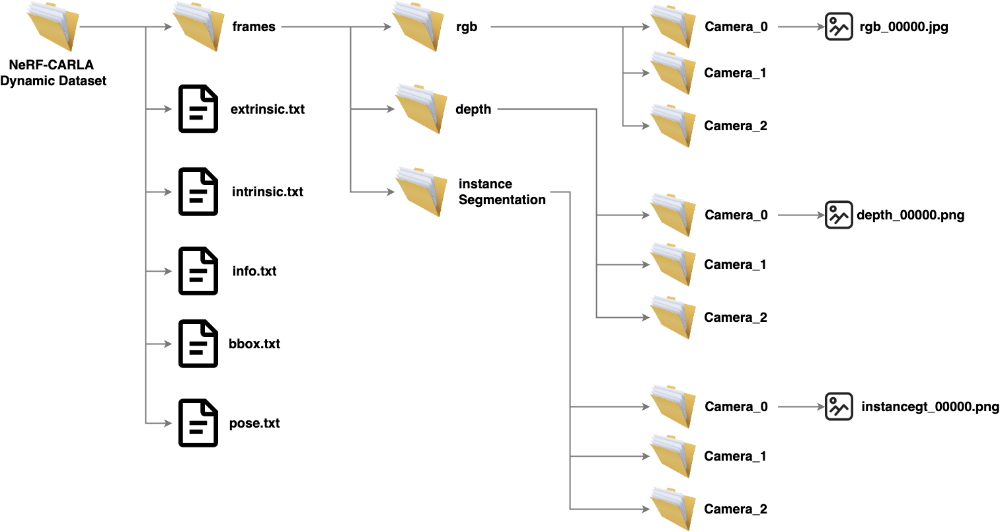

To generate the dataset for dynamic scenes, first set up the experimental configuration with the necessary camera setup in src/experiments/experiments.py. Define additional parameters such as the number of vehicles to spawn, vehicle types, autopilot settings, stopping criteria, and the ego vehicle location in src/scripts/generic_mars_capture.py. Then, run the following command to generate NCD dataset in a benchmark format.
```sh
python -m src.scripts.generic_mars_capture
```

<br>

# Waymo-style Multi-camera Dataset for Autonomous Driving
The Waymo-style representation generates a multi-camera driving dataset compatible with existing autonomous-driving reconstruction pipelines. At each timestamp, it captures synchronized per-frame data from a user-defined camera setup—for example, the five Waymo-convention cameras: `FRONT`, `FRONT_LEFT`, `FRONT_RIGHT`, `SIDE_LEFT`, and `SIDE_RIGHT`. The camera number, placement, orientation, and sensor settings can all be modified to create different data-collection configurations.

Each camera output includes an RGB image, dynamic-object mask, surface normals, sky mask, camera intrinsics, camera-to-ego extrinsics, and ego-vehicle pose. For each scene, the exporter also saves LiDAR point clouds with camera projections, dynamic-object tracks, scene metadata, and timestamps.

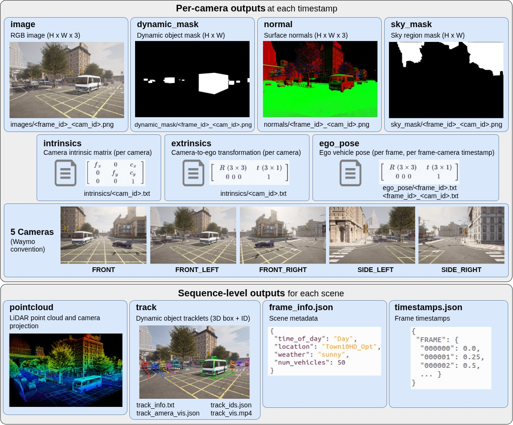

To generate a Waymo-style scene, first define the camera setup and capture settings in `src/scripts/waymo_capture.py` through `camera_transforms` and `camera_bp`. In the same file, configure scene-level settings such as the map, weather, vehicle count and types, autopilot behavior, capture duration, and ego-vehicle spawn point. You can also define a fixed trajectory or create edge-case scenarios by modifying vehicle trajectories and speeds. Then run:
```sh
python -m src.scripts.waymo_capture
```

<br>

# RGB, Depth, and Semantic Camera on Static Background
<p align="center">
  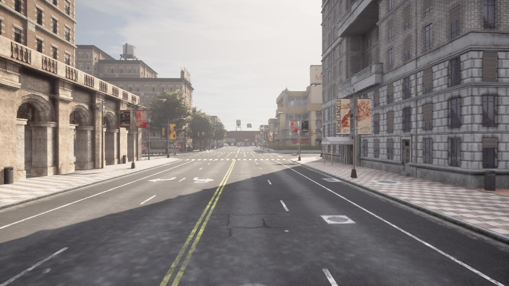
  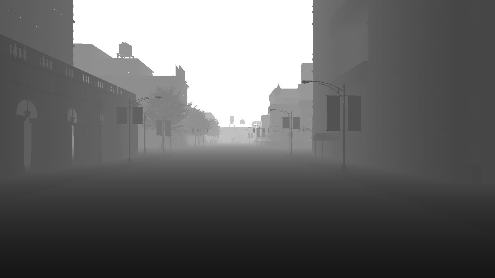
  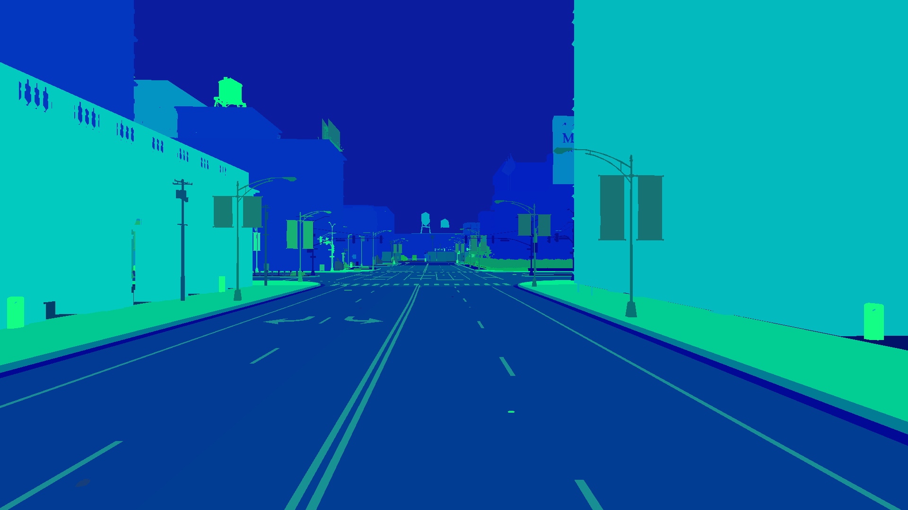
</p>

<br>

# Spawning Numerous Diverse Vehicles
<p align="center">
  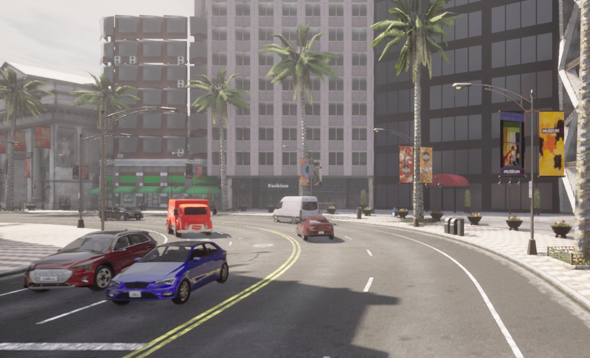
  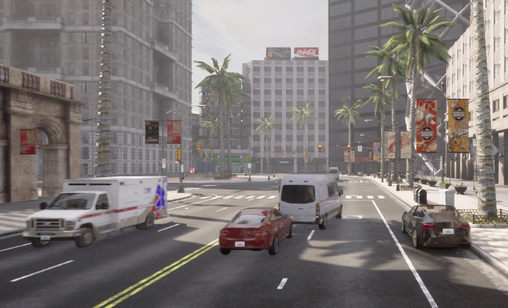
  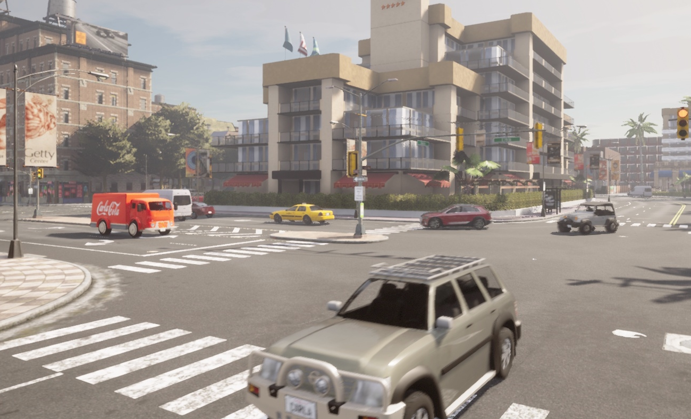
  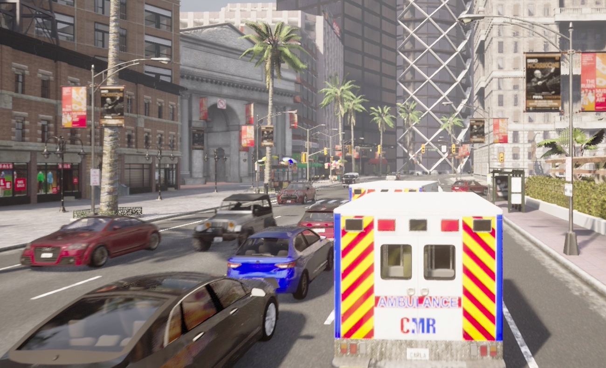
</p>

<br>

# 2D and 3D Bounding Box of Dynamic Objects
<p align="center">
  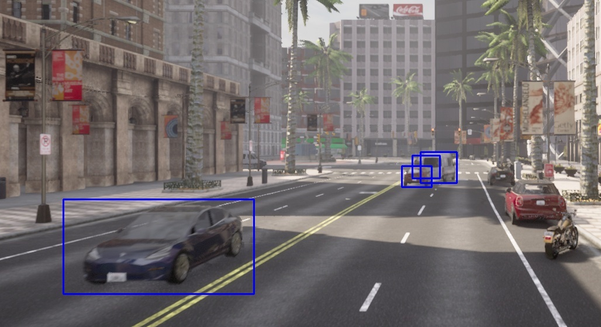
  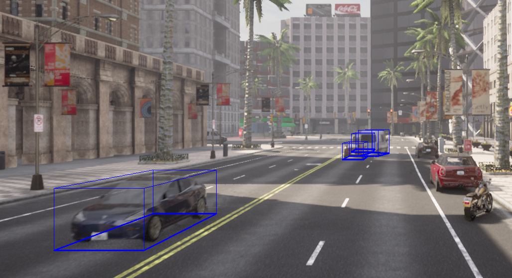
</p>


<br>

In addition to the current implementation, many other enhancements can be added to the Python files, including features such as spawning pedestrians with tracking information, defining custom trajectory paths for each vehicle within CARLA. The dataset can then be generated to train NeRFs and state-of-the-art 3DGS methods in dynamic environments effectively.
