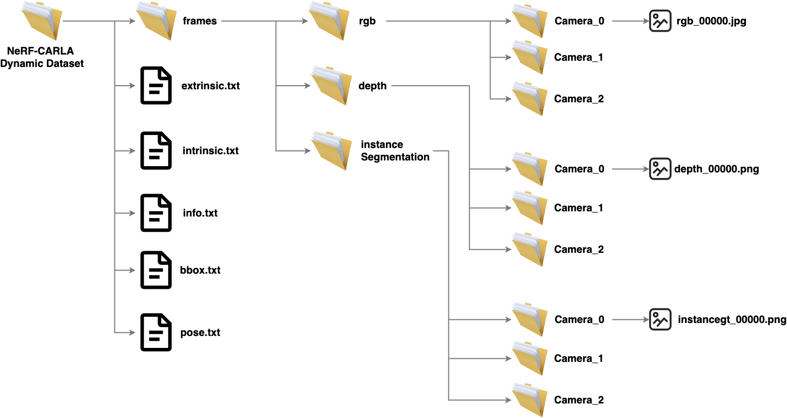
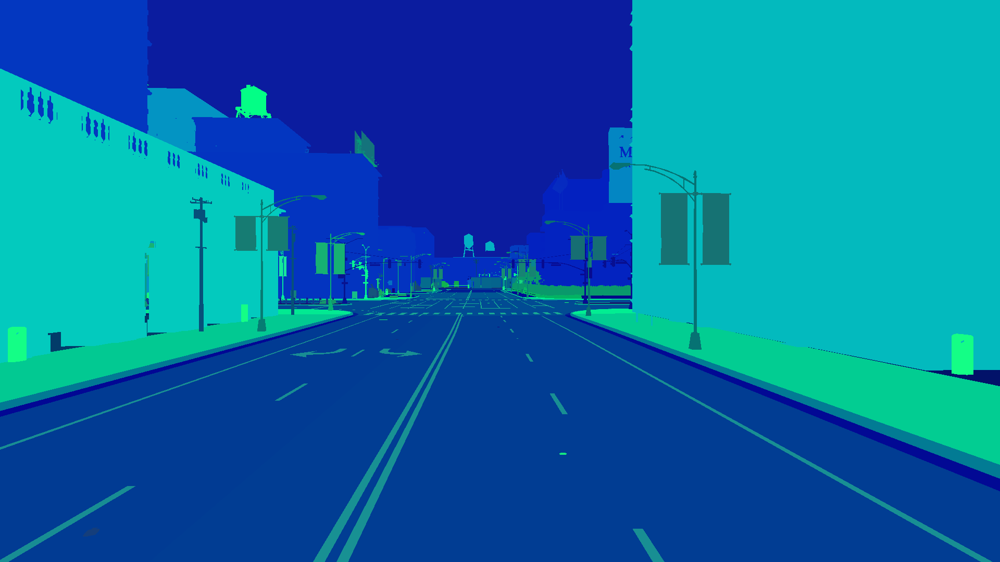

# Carlo for generating NeRF-CARLA Dynamic (NCD) Dataset

This repository provides two data parsers for generating training datasets for NeRFs:
- **Static Scenes**: *generic_nerf_capture.py*
- **Dynamic Scenes**: *generic_mars_capture.py*

<br>

# Static Scene Dataset for Nerfstudio API
Defining the required camera setup in *src/experiments/experiments.py*, run the following command to get a sequence of RGB images with camera parameters for static scenes.
```sh
python -m src.scripts.generic_nerf_capture
```

<br>

# NCD Dataset format for training dynamic scenes


To generate the dataset for dynamic scenes, first set up the experimental configuration with the necessary camera setup in src/experiments/experiments.py. Define additional parameters such as the number of vehicles to spawn, vehicle types, autopilot settings, stopping criteria, and the ego vehicle location in src/scripts/generic_mars_capture.py. Then, run the following command to generate NCD dataset in a benchmark format.
```sh
python -m src.scripts.generic_mars_capture
```

<br>

# RGB, Depth, and Semantic Camera on Static Background
<p align="center">
  
  
  
</p>

<br>

# Spawning Numerous Diverse Vehicles
<p align="center">
  
  
  
</p>

<br>

# 2D and 3D Bounding Box of Dynamic Objects
<p align="center">
  
  
</p>


<br>

In addition to the current implementation, many other enhancements can be added to the Python files, including features such as spawning pedestrians with tracking information, defining custom trajectory paths for each vehicle within CARLA. The NCD dataset can then be generated to train NeRFs in dynamic environments effectively.
